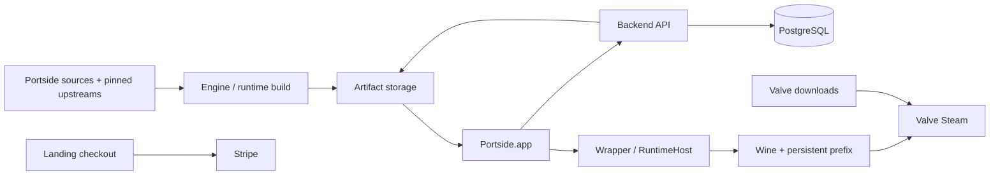

# Portside architecture

**2026-09-08 continuation:** [Sikarugir installation integration](SIKARUGIR_INSTALLATION.md)
now connects the approved original composition to the desktop installer and
runtime workflow. Preparation belongs to Portside and must not expose an upstream
setup wizard. Earlier direct-Wine/incomplete-integration descriptions below are
historical where superseded by that contract. Release and graphical acceptance
remain separate from local automated checks.

**Target clarified on 2026-09-08:** Portside automates Sikarugir installation,
configuration, updates and Steam launch. The approved original composition is
now connected to the desktop installer and runtime assembly. The retained
direct-Wine path described below is the legacy implementation. Using Sikarugir's
Wine fork alone does not integrate its launcher, SDK or renderer composition.
See [SIKARUGIR_INTEGRATION](SIKARUGIR_INTEGRATION.md) for inspected evidence,
the approved original baseline and remaining implementation work.

Portside is a native macOS launcher that prepares a private Windows Steam
environment using a Portside-assembled Sikarugir runtime. Valve supplies Steam and games;
Portside does not redistribute them or bypass DRM or anti-cheat. The desktop
targets Apple silicon and macOS 13+, with English application UI.

This document describes code at the [audit snapshot](STATUS.md), not proof of a
deployed service, a working game, or a completed customer installation. Read
[RUNTIME.md](RUNTIME.md), [RELEASE.md](RELEASE.md), and [SECURITY.md](SECURITY.md)
for their contracts; source code takes precedence when it changes.

## Components and ownership

| Component             | Responsibility and source entry point                                                                                                                                                                                                                                                          |
| --------------------- | ---------------------------------------------------------------------------------------------------------------------------------------------------------------------------------------------------------------------------------------------------------------------------------------------- |
| `Portside.app`        | SwiftUI setup, installation gate, license activation, app preflight, runtime preparation and Steam handoff. [`PortsideApp.swift`](../apps/desktop/Sources/Portside/PortsideApp.swift) owns orchestration.                                                                                      |
| `PortsideCore`        | Shared installation, trust, downloads, state, process ownership, compatibility and bootstrap logic. No Sparkle or Sentry package dependency; see [`Package.swift`](../apps/desktop/Package.swift).                                                                                             |
| `PortsideInstaller`   | Auxiliary executable in the main app's `Contents/MacOS`; safely copies the commercial app to `/Applications/Portside.app`, revalidates replacement identity, retains the old app and optionally ejects the original DMG. [`main.swift`](../apps/desktop/Sources/PortsideInstaller/main.swift). |
| `PortsideAgent`       | Embedded background app under `Contents/Helpers/PortsideAgent.app`. One mode observes managed Steam/game processes; another prepares runtime downloads. It is not the Wine launcher. [`main.swift`](../apps/desktop/Sources/PortsideAgent/main.swift).                                         |
| `PortsideRuntimeHost` | Separate Swift package and native executable inside the downloaded wrapper. Resolves its bundle, starts Wine/wineboot or winetricks through `Process`, and records sanitized output. [`main.swift`](../apps/runtime-host/Sources/PortsideRuntimeHost/main.swift).                              |
| Wrapper               | Mutable `PortsideBaseline.app` assembled from the [Portside template](../runtime/wrapper-template/Contents/Info.plist), host, engine and winetricks, with a link to the persistent prefix. Separate from `Portside.app`.                                                                       |
| Wine engine           | Portside compilation of pinned Wine source, executing Windows programs; its build and inventory are in [RUNTIME.md](RUNTIME.md).                                                                                                                                                               |
| winetricks            | Pinned source script packaged as a runtime component; the `steam` verb obtains Steam from Valve during setup. It is not an app updater.                                                                                                                                                        |
| Backend               | NestJS HTTP control plane, Prisma/PostgreSQL records, license device challenges, manifests, artifact redirects and release administration. [`main.ts`](../apps/backend/src/main.ts), [`app.module.ts`](../apps/backend/src/app.module.ts).                                                     |
| Worker / cron         | Separate backend processes: workflow reconciliation in [`worker.ts`](../apps/backend/src/worker.ts); cron entry in [`cron.ts`](../apps/backend/src/cron.ts), whose current job is a log-only placeholder.                                                                                      |
| Landing               | TanStack Start/React website and server-side Stripe checkout creation. [`__root.tsx`](../apps/landing/src/routes/__root.tsx), [`checkout.functions.ts`](../apps/landing/src/lib/checkout.functions.ts). Its visible Portuguese copy is a gap against the English product policy.               |
| Sparkle               | Swift dependency updating the signed application through appcast enclosures. Integration: [`PortsideUpdateCoordinator.swift`](../apps/desktop/Sources/Portside/PortsideUpdateCoordinator.swift).                                                                                               |
| Artifact storage      | A configured S3-compatible bucket for engine/runtime/app objects. Download clients receive temporary signed URLs, never bucket credentials. See [`AppConfig`](../apps/backend/src/core/app-config.ts). Actual bucket access was not verified during this audit.                                |

There is no separate top-level `packages/` workspace. `apps/desktop` contains
four Swift products (including the core library); `apps/runtime-host` is an
independent Swift package. Backend dependencies are fixed by npm's lockfile;
landing dependencies by Bun's lockfile; Swift dependencies by
[`Package.resolved`](../apps/desktop/Package.resolved).

Other top-level areas have distinct roles: `scripts/` builds and validates;
`.github/workflows/` orchestrates CI/publication; `runtime/` owns the wrapper
template; `upstream/` owns locks, audited licenses and the patch policy (no
checked-in patch set exists at this audit base);
`vendor/` contains source snapshots, not authoritative Portside documentation or
prebuilt release payloads. [PROJECT_GUIDE.md](PROJECT_GUIDE.md) routes scripts.

The Stripe branch currently has no implemented payment-webhook-to-license
issuance connection. The diagram is a dependency map, not deployment evidence.

## First installation and bootstrap

1. `PortsideModel.startAutomatically()` inspects location. A commercial bundle
   must be writable, resolve exactly to `/Applications/Portside.app`, and be
   outside a DMG or App Translocation. Debug and explicitly packaged
   `development` builds are exempt. A move request uses
   [`ApplicationInstallation.swift`](../apps/desktop/Sources/PortsideCore/ApplicationInstallation.swift)
   and [`ApplicationInstallationTransaction.swift`](../apps/desktop/Sources/PortsideCore/ApplicationInstallationTransaction.swift),
   then reopens the installed copy before the original instance exits.
2. Commercial bootstrap authenticates and quiesces older runtime-only updater
   agents, then takes a shared process lease. It initializes Sparkle and awaits
   an immediate appcast probe before license/state/runtime work. The
   [`bootstrap state machine`](../apps/desktop/Sources/PortsideCore/PortsideBootstrap.swift)
   is in memory; only the updater relaunch receipt persists. Sentry initializes
   earlier, during app construction; the location gate is not a blanket ban on
   diagnostic activity.
3. After the app preflight permits continuation, load environment state and
   validate/activate the license in a configured non-Debug build. Initial setup
   checks Apple silicon and at least 12 GB available space. The macOS 13 floor
   comes from package/bundle deployment metadata; `SystemRequirements.validate`
   itself does not compare OS versions.
4. Probe Rosetta by running an x86_64 system program; if absent, invoke Apple's
   `softwareupdate --install-rosetta --agree-to-license`. Rosetta comes from
   Apple, not the runtime bucket. See
   [`RosettaManager`](../apps/desktop/Sources/PortsideCore/RuntimePipeline.swift).
5. Fetch and authenticate a runtime manifest, download wrapper/engine/winetricks,
   verify sizes and SHA-256, assemble a wrapper, and create or reuse the separate
   prefix. [`PortsideRuntimePipeline.swift`](../apps/desktop/Sources/PortsideCore/PortsideRuntimePipeline.swift)
   owns this path. Recovery limits are in [RUNTIME.md](RUNTIME.md); an existing
   directory is not proof of a verified customer installation.
6. If `steam.exe` is absent, invoke the wrapper's host with `--winetricks steam`.
   Stop only processes attributed to this wrapper/prefix after setup, then open
   the wrapper through LaunchServices for a clean second launch.
7. The readiness monitor requires a window-sized on-screen entry and a webhelper
   process to report `visibleButUnverified`. With no detected launch/renderer
   failure, the app marks automatic setup complete, starts the compatibility
   agent/runtime updater and closes `Portside.app` without a questionnaire.
   The diagnostic report remains unverified; automatic completion does not
   establish rendered content or interaction.
   Game acceptance remains a separate [manual validation](VALIDATION.md).

When a copy outside Applications detects a newer trusted installed app, it opens
that app automatically and exits after successful LaunchServices handoff. It
also handles a newer app arriving during the installation transaction. The
signature, same-publisher and no-downgrade checks still apply; actual opening
failure retains the retry UI. See [the installation follow-up](INSTALLATION_REOPEN_FIX.md).

## Subsequent openings and process lifetime

Every new process repeats the location and awaited app-update gates. A completed
installation validates the wrapper's layout and fetches signed runtime policy,
including when the wrapper already exists. If managed Steam is stopped, it
prepares and applies a pending runtime update. If Steam is running, runtime
application is deferred. Missing `steam.exe` sends the user through repair.

A prepared existing installation automatically launches Steam when it is stopped,
waits for window/webhelper evidence, then starts helpers and exits the main app
without requiring user confirmation. LaunchServices owns the wrapper launch independently; closing the launcher
does not intentionally terminate Wine/Steam. This process model is implemented,
but persistence of a real rendered Steam session remains an acceptance test.

[`PortsideAgent`](../apps/desktop/Sources/PortsideCore/PortsideAgent.swift) scans
managed libraries approximately every 30 seconds and exits when managed Steam
processes disappear. `--runtime-updater` instead runs
[`PortsideRuntimeUpdateWorker`](../apps/desktop/Sources/PortsideCore/PortsideRuntimeUpdateWorker.swift),
which prepares downloads every 15 minutes and does not apply them or exit with
Steam. Neither mode is registered as a launchd service in this source path.
The worker's singleton lock and the
[foreground/background lease](../apps/desktop/Sources/PortsideCore/PortsideRuntimeActivityLease.swift)
have different purposes. An unused daily-check helper is not the active cadence.

## Licensing and commercial data flow

The [landing checkout server function](../apps/landing/src/lib/checkout.functions.ts)
creates a Stripe Checkout session. The return page is not proof of payment:
[`order.functions.ts`](../apps/landing/src/lib/order.functions.ts) always returns
`pending`; webhook validation, order persistence, automatic license issuance and
email delivery are not connected. See [LICENSING.md](LICENSING.md),
[BACKEND.md](BACKEND.md) and
[COMMERCIALIZATION.md](COMMERCIALIZATION.md).

For a pre-existing active license record, the
[backend service](../apps/backend/src/modules/licenses/license.service.ts)
looks up the purchase key using HMAC, binds a P-256 device public key, and issues
an Ed25519-signed token. The
[desktop license client](../apps/desktop/Sources/PortsideCore/PortsideBackendClient.swift)
verifies the configured server key, token device ID and offline deadline before
persisting it in Keychain. The private device key uses Secure Enclave when
available, otherwise a non-synchronizing device-local Keychain key.

Within the signed offline deadline the desktop accepts the cached token without
contacting the API. Afterwards it requests a challenge, signs with the device
key, and verifies/persists the refreshed token. Failure returns to activation
UI; it does not erase user data. Backend deactivation/revocation exists; the
current desktop root view exposes activation only. License gating is local
bootstrap behavior: public appcast, manifest and artifact routes do not require
a license entitlement. Security and concurrency limits are in
[SECURITY.md](SECURITY.md).

## Two update systems

Sparkle replaces `Portside.app`; the runtime manifest governs
wrapper/engine/winetricks. Their public keys, artifacts and failure boundaries
are separate even though release scripts coordinate app/runtime metadata.

The app preflight's information probe has a 20-second deadline. A known critical
update or failed expected-version relaunch keeps Steam blocked. Ordinary offline
lookup can permit the existing app; an installation session has a separate
10-minute deadline that blocks on timeout. Sparkle's standard UI and automatic
update preferences govern installation. A relaunch receipt checks
`CFBundleVersion` before runtime work. A separately signed runtime
`minimumPortsideVersion` is cached and remains mandatory offline. See
[UPDATE_ARCHITECTURE.md](UPDATE_ARCHITECTURE.md).

The backend currently exposes a production-only channel. Older staging and
manual-promotion descriptions are not evidence that such an environment exists.
Current publication triggers and their conflict with the agent policy against
automatic promotion are explicit in [RELEASE.md](RELEASE.md) and
[DECISIONS.md](DECISIONS.md). Agents must not publish or promote implicitly.

## Local persistence and data ownership

All paths below are relative to the user's Application Support `Portside/`
directory, as defined by [`PortsidePaths`](../apps/desktop/Sources/PortsideCore/PortsideCore.swift).
They are runtime locations, not repository files.

| Location                                | Owner / lifecycle                                                                                                                                                                            |
| --------------------------------------- | -------------------------------------------------------------------------------------------------------------------------------------------------------------------------------------------- |
| `environment.json`                      | Launcher state and local paths; atomic JSON writes. Corrupt state is retained as a `.corrupt-<UUID>.bak` and recovered from layout where possible.                                           |
| `Wrappers/PortsideBaseline.app`         | Replaceable wrapper with engine and winetricks; separate from the signed main application.                                                                                                   |
| `Prefixes/PortsideBaseline`             | Persistent Wine registry, Windows user files and Steam installation/account state. Wrapper `Contents/SharedSupport/prefix` links here. Never delete for repair, license failure or rollback. |
| `SteamLibrary`                          | Additional managed scan root; created by Portside, but no setup code automatically redirects Steam's game installation here. Games may remain within the prefix's Steam `steamapps`.         |
| `Runtime/Pending`, `Runtime/rollback-*` | Prepared downloads and retained wrappers. One completed rollback wrapper is retained; these are not a backup of games/saves and rollback is not fully transactional.                         |
| `Manifests`                             | Authenticated cached runtime JSON and ETag. Preserve signed minimum-version behavior.                                                                                                        |
| `Cache/Downloads`, legacy `Downloads`   | Re-creatable runtime downloads. Direct non-symlink entries expire after 24 hours once the active wrapper validates.                                                                          |
| `Cache/XDG`                             | Runtime-tool cache. Cleanup must never broaden into prefix/library removal.                                                                                                                  |
| Legacy `Backups/Steam-prefix-*`         | Recovery points made by older releases. Startup retention keeps the newest one and never enters the active prefix.                                                                           |
| `Profiles`                              | Locally derived or explicitly validated game/renderer configuration.                                                                                                                         |
| `Logs`, `Diagnostics`                   | Technical logs/reports; may contain local metadata and require review before sharing.                                                                                                        |
| `app-update-relaunch.json`, lock files  | Expected app build across relaunch and process coordination; not persisted bootstrap progress.                                                                                               |
| Keychain                                | License token and device private key; outside the Application Support tree.                                                                                                                  |

The user owns games, saves, Steam credentials and prefix contents. Valve manages
the Steam account/session. Backend owns license/device/challenge and release
records; storage owns published binary objects. Portside code must not copy a
native macOS Steam session, migrate another user's prefix, or inspect account
files to determine compatibility.

After validating the active wrapper, startup maintenance bounds replaceable
storage to one rollback, one failed wrapper and one legacy prefix recovery
point. Abandoned extraction and pending-staging directories older than 24 hours
are removed, as are direct entries in the current and legacy download caches
after 24 hours. History ordering accepts current millisecond names, legacy
second names and filesystem attribute dates when archived modification dates
are invalid. The maintenance matches only direct, non-symlink entries in
Portside-owned locations; it never traverses the active prefix or game library.

## Compatibility boundaries and implementation gaps

[`CompatibilityEngine.swift`](../apps/desktop/Sources/PortsideCore/CompatibilityEngine.swift)
parses bounded Valve metadata and PE evidence within managed roots; it does not
execute binaries to classify imports. The default profile provider has no remote
adapter. A protocol for backend-validated profiles does not constitute a deployed
profile service.

[`RendererCompatibility.swift`](../apps/desktop/Sources/PortsideCore/RendererCompatibility.swift)
contains inventory, per-executable Wine registry configuration and fallback
policy, but still resolves `Contents/SharedSupport/wine`; the current host and
installer use `Contents/SharedSupport/engine`. The agent does not orchestrate the
tested automatic post-failure fallback policy. Treat this integration as
**Implemented but not end-to-end validated**, not current renderer support.
Agent-recorded game observations always leave visual state unverified.

Approved dependency roles are explicit: Wine/winetricks from locked sources,
Steam from Valve, Rosetta from Apple, Sparkle/Sentry from SwiftPM, Stripe for
checkout, PostgreSQL and S3-compatible storage behind the backend, and GitHub
Actions/Apple signing services for release. Source upstream URLs are provenance;
they must not become commercial binary-download fallbacks. See
[upstream rules](UPSTREAM_MIRRORING.md) and [security](SECURITY.md).
