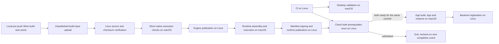

# Builds, publication and updates

This is the current release contract, not evidence that a live release passed.
See [STATUS.md](STATUS.md) for the audit snapshot and [TESTING.md](TESTING.md)
for acceptance requirements. All external service, certificate, secret,
Environment-protection and publication state is **Unknown — not verified during
this audit**.

## Channels and authority

The current code supports one commercial channel, `production`, and one
configured S3-compatible publication bucket. Local bundles declare
`development`; GitHub desktop validation produces noncommercial artifacts.
Neither is a staging service or a promotion candidate channel.

Staging builds and staging-to-production promotion are **not implemented in the
current system**. Commit `11a71ad` removed the intermediate channel and its
storage-promotion script in August 2026. Commit `1ce78b2` removed the secondary
bucket in September 2026. Commit `9d60807` enabled automatic app releases after
CI on `main`. See [DECISIONS.md](DECISIONS.md) before revisiting these choices.
Do not invent a staging command or point development at production by accident.

Future agents must not automatically promote, publish, dispatch release
workflows, or change external services on their own authority. An explicit
request for that task is required. This operational rule does not change the
checked-in workflows, which currently publish automatically under the
conditions below. GitHub Environment approval rules are configured externally;
the YAML's `environment: production` alone does not prove required reviewers.

## Workflow map

| Workflow                                                                           | Trigger and output                                                                                                                                                         | Boundary                                                                                                                                      |
| ---------------------------------------------------------------------------------- | -------------------------------------------------------------------------------------------------------------------------------------------------------------------------- | --------------------------------------------------------------------------------------------------------------------------------------------- |
| [CI](../.github/workflows/ci.yml)                                                  | Push/PR to `main`, except landing-only paths; production-source policy and runtime source-binding tests plus backend dependency installation, Prisma schema validation and build.                           | No Swift tests, backend unit tests, lint or typecheck job. Local hooks carry broader checks.                                                  |
| [Build Desktop Validation](../.github/workflows/build-desktop.yml)                 | Successful CI on `main` with relevant desktop/packaging paths, or dispatch; arm64 app ZIP, DMG, dSYM and checksums, retained 14 days.                                      | Development bundle, ad hoc by default; no notarization or GUI acceptance.                                                                     |
| Railway connector                                                                  | Provider-side deployment of the Landing service from `main`; local pre-push runs Bun lint, typecheck and build before publication.                                         | External to GitHub Actions; service variables, domains and the deployed revision remain provider-side state.                                  |
| [Build Portside Engine](../.github/workflows/build-engine.yml)                     | Relevant `main` changes or dispatch; Pre-push compiles locally; Linux verifies the uploaded input, macOS runs short execution checks, then Linux publishes with 30-day evidence.                                                            | Independent source engine; no app release or runtime manifest.                                                                                |
| [Build Portside Runtime](../.github/workflows/build-runtime.yml)                   | Assembly changes or successful engine workflow; dispatch requires runtime version and artifact URL prefix. Combined Linux detection/preflight, macOS assembly/validation, then Linux manifest signing and storage upload.  | Uses existing engine; one-day assembly handoff, full and metadata-only evidence retained 30 days. No backend manifest registration here.                               |
| [Release Portside](../.github/workflows/release-production.yml)                    | CI or runtime completion on `main` rechecks both prerequisites for the same source; existing app/runtime-host/packaging filter or explicit main dispatch applies.                                               | Configured app, signature, notarization, upload, then backend runtime and app registration. Automatic publication, not gated by GUI workflow. |
| [Validate Clean Portside Runtime](../.github/workflows/validate-clean-install.yml) | Dispatch with selected current/optional previous runtime artifact; self-hosted macOS arm64 GUI session.                                                                    | Operator-assisted test. Script needs an interactive terminal to confirm checks; otherwise it exits 2 without accepting GUI success.           |
| Railway connector                                                                  | Provider-side deployment of the API, Worker and Cron services using the three `apps/backend/railway.*.json` configurations.                                                | External to GitHub Actions; service variables, domains and the deployed revision remain provider-side state.                                  |
| [Sync Upstreams](../.github/workflows/sync-upstreams.yml)                          | Daily 03:17 UTC or dispatch; syncs sources and maintains a PR with the scoped `PORTSIDE_UPSTREAM_SYNC_TOKEN`, allowing PR checks to start without `GITHUB_TOKEN` approval. | May commit/push its automation branch and close obsolete PRs. Never merges or publishes runtime artifacts.                                    |

Engine/assembly change decisions come from
[changed-components.sh](../scripts/build-runtime/changed-components.sh), in
addition to YAML path filters. Engine inputs trigger local pre-push Wine compilation/cache reuse;
wrapper/winetricks and app changes assemble using the recipe-selected engine.
The engine workflow never invokes the Wine compiler. Its push paths exclude
assembly-only scripts. Missing local input fails on Linux before macOS allocation;
there is no remote compilation or active waiting fallback.
Release event routing and change-filter changes alone do not allocate native
engine/runtime jobs; CI and local script tests validate that orchestration.

Every app release requires successful CI and runtime assembly of the same
`target_sha`. Completion of **either** CI or runtime starts a short Linux
prerequisite check. If the other is unfinished, the check exits successfully
with `ready=false`; its completion event rechecks later. There is no polling
loop, five-hour waiter, or allocated runner between workflows. Only `ready=true`
starts the macOS app job. Failed/cancelled builds, skipped assembly and expired
evidence cannot qualify; an older commit is never a substitute. Manual release
fails promptly unless both prerequisites already exist; it never dispatches a build.

Event routing uses the stable workflow `path`, not the run `name`: GitHub can
replace `name` with the custom execution title. Runtime `run-name` carries its
actual checkout SHA because a `workflow_run`
event can report a different default-branch head. Runtime detection, assembly
and publication check out the engine event SHA. The release prerequisite job
checks out its workflow's orchestration revision, resolves the source from the
trigger, and the native app build checks out that `target_sha`. Runtime
concurrency remains per source SHA. Release concurrency serializes completion
events; a successful app storage publication for the same source suppresses
another automatic publication, even if later registration failed. Such recovery
requires explicit manual dispatch. Read-only GitHub API checks use `actions: read`.



Artifact transfers include only named archives, checksums and provenance/SBOM, excluding
`work/`, compiler objects, extracted trees and caches. Already-compressed archives
use artifact compression level zero. The runtime handoff expires after one day;
final runtime metadata/evidence and engine evidence expire after 30 days.
[validate-publication.py](../scripts/build-runtime/validate-publication.py)
recomputes SHA-256 and size and binds transferred metadata to the checkout and
workflow run before Linux signing/upload. It does not replace native Wine
execution, bootstrap/layout checks, manifest authentication or final Developer ID
acceptance. The temporary manifest private key is removed on job completion.

Wine compilation now runs locally through
[prepare-engine-push.py](../scripts/build-runtime/prepare-engine-push.py), invoked
by the pre-push hook only for engine-changing outgoing `main` commits. It exports
the exact outgoing Git revision, builds in an owned disposable source tree and
reuses the existing local source/toolchain-qualified Wine install cache. A
completed input for the same commit is reused on push retries. Ordinary app,
docs and routing-only changes do not compile Wine. GitHub-hosted engine cache
restore/save and compiler-tool installation were removed.

Before pushing, configure AWS CLI and the existing `PORTSIDE_PUBLIC_BUCKET`,
`PORTSIDE_S3_ACCESS_KEY_ID`, `PORTSIDE_S3_SECRET_ACCESS_KEY`, `PORTSIDE_S3_REGION`
and `PORTSIDE_S3_ENDPOINT` variables through an approved local secret provider.
Alternatively, a developer already authenticated to the linked Railway project
can select its production API as the local provider:

```sh
git config portside.engineStorageProvider railway
```

The helper checks the linked API's repository against Git origin, requires the
production environment and reads only the five storage values into memory. It
maps the backend's `S3_BUCKET`, `S3_ACCESS_KEY_ID`, `S3_SECRET_ACCESS_KEY`,
`S3_REGION` and `S3_ENDPOINT` names to the publisher names above. It does not
write variables, deploy Railway services or store secret values in Git/config/logs.
A complete explicitly supplied environment takes precedence; incomplete values
cannot be combined with another provider. GitHub continues using its existing secrets.
Only variable names belong in this repository. Missing transfer configuration
blocks the push before expensive compilation. The hook uploads only unpublished
input under `runtime/build-inputs/engines/<source-sha>/<engine-version>/` in the
existing bucket; this is not a client download route or a new product channel.
The validated engine storage key and production destinations remain unchanged.
Build input retention is separate from installed runtimes; no user runtime or
prefix is a cleanup target.

[engine-input.py](../scripts/build-runtime/engine-input.py) rechecks exact Wine
commit/snapshot, recipe-derived identity, producer source commit, SHA-256 and
size on Linux. A macOS job with a ten-minute cap uses Python 3.12 safe tar
extraction and executes the real x64/x86 controls in a disposable prefix. Its
receipt binds this workflow run to both metadata files and the archive hash.
Linux publication requires that receipt; locally claimed build provenance alone
cannot publish through CI. Original local producer identity remains in metadata.
Production keys are not passed into the local compilation subprocess. Compiler
output is retained in a sanitized local `build.log`; a failed build blocks push. Native/PE
prefix maps and a virtual Wine installation prefix avoid embedded developer
paths; both packaging and CI extraction audit the produced tree before publication.
Both source recipes set the macOS 13.0 deployment floor, and native validation
checks all nested Mach-O architectures and minimum OS versions. The local SDK
version must not silently raise the app's supported OS requirement.

The compile-only review command below creates a local input without uploading
or pushing; the normal pre-push invocation always requires a successful handoff:

```sh
python3 scripts/build-runtime/prepare-engine-push.py --build-only BASE_SHA OUTGOING_SHA
```

Runtime assembly installs only its missing storage client, not the Wine compiler
toolchain. Ubuntu 24.04 supplies AWS CLI and jobs verify tools before publication.
App signing/notarization and runtime assembly remain native jobs; Apple
notarization still uses `notarytool --wait`. This change preserves the qualifying
app-change filter and does not establish graphical Steam or Developer ID runtime
acceptance.

## Application release sequence

The [release workflow](../.github/workflows/release-production.yml) checks the
selected commit has successful CI jobs named `Production source policy` and
`Backend schema and build`. After runtime assembly, it binds downloaded
provenance and wrapper `sourceCommit` to `target_sha`, binds `buildId` to the
selected workflow run, and requires signed/unsigned manifest payload agreement.
Existing manifest and layout checks still apply. It uses that runtime version as
the base app version. When the current API appcast already has that or a later
version, it increments the latest app patch number. If that lookup fails, the
base version can be reused; do not treat this as an unconditional no-overwrite
guarantee.

1. [build_release.sh](../scripts/build_release.sh) builds arm64 `Portside`,
   `PortsideAgent` and `PortsideInstaller`; copies Sparkle; injects API/feed,
   public keys, artifact hosts, version and channel into app/helper plists;
   and produces an unsigned bundle and dSYM.
2. [sign_release.sh](../scripts/sign_release.sh) signs the reused runtime
   manifest with the configured runtime key, then signs nested Sparkle code,
   Agent, Installer and the app using Developer ID Application. It uses
   `--options runtime`, timestamps and the app
   [entitlements](../apps/desktop/Resources/Portside.entitlements), verifies
   codesign, and creates an intermediate ZIP.
3. [notarize_release.sh](../scripts/notarize_release.sh) submits that ZIP with
   `notarytool --wait`, staples and validates the app, verifies codesign and
   Gatekeeper assessment, creates a compressed DMG, submits and staples it,
   then archives the stapled app as `Portside-<version>-notarized.zip`.
   A ZIP is not itself stapled; the app inside is.
4. [validate_release_bundle.sh](../scripts/validate_release_bundle.sh) verifies
   production plist configuration, matching Agent public configuration,
   Installer signature, English development region, app signature and a
   read-only DMG containing only `Portside.app` at its top level. It does not
   open the installed UI or test Sparkle.
5. [generate_appcast.sh](../scripts/generate_appcast.sh) uses Sparkle's
   `generate_appcast`, external EdDSA key and at most three versions. The
   workflow supplies the newly notarized ZIP and a release-note file. An
   enclosure's `sparkle:edSignature` authenticates the archive, not every
   property of the XML feed.
6. [publish_release.sh](../scripts/publish_release.sh) uploads app ZIP/DMG,
   appcast, checksums and runtime metadata. Workflow sets
   `PORTSIDE_SKIP_RUNTIME_ARCHIVES=1` because runtime archives already exist
   in storage. A subsequent Linux job registers runtime records/manifest,
   then the application release in the backend.

Private signing files are materialized outside the checkout on an ephemeral
runner; the app receives public keys only. The mutable Wine wrapper is not
signed by the desktop Developer ID signing script; its distribution trust is
the runtime manifest. Hardened Runtime options on the app do not establish
that the wrapper or Wine has been independently notarized.

The [0.1.28 first-launch investigation](STEAM_FIRST_LAUNCH_FIX.md) proved a
Darwin loader architecture/layout failure that persists with Developer ID.
The corrected engine recipe targets x86_64 and requires real x64/x86 Windows
command execution in disposable prefixes before packaging and after extraction.
Its new architecture/recipe storage key prevents reuse of the earlier arm64
engine for the same Wine commit. This changes engine selection, not publication
authority. Final runtime Developer ID/notarization remains a separate acceptance
requirement; the engine execution checks do not replace signing.

The backend [runtime service](../apps/backend/src/modules/runtime/runtime.service.ts)
serves `/v1/appcast.xml` from registered production/superseded app releases
(up to three), and `/v1/runtime/manifest` from the published production manifest.
[App download routes](../apps/backend/src/modules/artifacts/app-download.controller.ts)
serve the stable [latest production DMG](https://api-production-6d06.up.railway.app/app/production/latest)
and versioned files using signed private storage redirects. The uploaded static
`appcast.xml` is a separate artifact; inspect the configured `SUFeedURL` and
actual API response during acceptance.

## Runtime publication and manual operations

[RUNTIME.md](RUNTIME.md) owns the source/build recipe. Engine storage keys are
under `runtime/engines/validated/<engine-version>/`; end-user runtime archives
and mutable discovery metadata are under `runtime/production/`. App files are
under `app/production/`. Archives use versioned names, but scripts use `aws s3
cp` without object-lock or conditional-write guarantees. No dual-bucket failover
or retention enforcement can be inferred from these scripts.

[register_runtime_release.sh](../scripts/register_runtime_release.sh) registers
source snapshots, a successful build record, published artifacts, a production
release and its signed manifest. It explicitly records `cleanInstall:
"not_verified"`. [registerRelease](../apps/backend/src/modules/runtime/runtime.service.ts)
marks qualifying records production directly; it does not wait for an
independent staging promotion. Runtime upload alone can leave the backend
unaware of a newly published runtime. Registration follows app publication,
so partial upload/registration failure needs reconciliation before declaring
customer availability.

There is an admin artifact-promotion endpoint, but it is not a stage-to-production
release workflow. The former storage-promotion script no longer exists. Manual
dispatch reprocesses the existing production release path; it is not a distinct
promotion environment.

## Configuration names

Values belong in the relevant approved secret store or runner environment,
never documentation, source, fixtures or bundle private material. “Required”
below describes script/workflow reads, not verified live provisioning.

| Scope                                                | Names and conditions                                                                                                                                                                                                                                                                                                                                                                   |
| ---------------------------------------------------- | -------------------------------------------------------------------------------------------------------------------------------------------------------------------------------------------------------------------------------------------------------------------------------------------------------------------------------------------------------------------------------------- |
| Upstream synchronization                             | `PORTSIDE_UPSTREAM_SYNC_TOKEN` is a fine-grained GitHub token restricted to this repository with Contents and Pull requests read/write access. It authenticates the automation branch push and PR maintenance so resulting PR checks start automatically; the workflow's built-in `GITHUB_TOKEN` remains read-only.                                                                    |
| Single storage target; engine/runtime/app publishers | `PORTSIDE_PUBLIC_BUCKET`, `PORTSIDE_S3_ACCESS_KEY_ID`, `PORTSIDE_S3_SECRET_ACCESS_KEY`, `PORTSIDE_S3_REGION`, `PORTSIDE_S3_ENDPOINT`. The historical variable name does not make the bucket public.                                                                                                                                                                                    |
| Runtime workflow                                     | `PORTSIDE_RUNTIME_DOWNLOAD_URL_PREFIX` (or dispatch `artifact_url_prefix`), `PORTSIDE_MANIFEST_SIGNING_KEY_ID`, `PORTSIDE_MANIFEST_SIGNING_KEY`; runtime version is dispatch `version` or derived from the run number.                                                                                                                                                                 |
| Configured desktop bundle                            | `PORTSIDE_VERSION`, `PORTSIDE_UPDATE_CHANNEL`, `PORTSIDE_API_BASE_URL`, `PORTSIDE_UPDATE_FEED_URL`, `PORTSIDE_SPARKLE_PUBLIC_KEY`, `PORTSIDE_RUNTIME_MANIFEST_PUBLIC_KEY`, `PORTSIDE_LICENSE_PUBLIC_KEY`, `PORTSIDE_LICENSE_KEY_ID`, `PORTSIDE_ARTIFACT_HOSTS`.                                                                                                                        |
| Release workflow additional inputs                   | `PORTSIDE_PUBLIC_BASE_URL` is currently required by preflight even though download URLs use the API; `PORTSIDE_ADMIN_BEARER_TOKEN` authorizes registration; `PORTSIDE_MANIFEST_SIGNING_KEY_ID`, `PORTSIDE_MANIFEST_SIGNING_KEY`, `PORTSIDE_SPARKLE_PRIVATE_KEY`. There is no current read of the older `PORTSIDE_RUNTIME_MANIFEST_JSON` secret.                                        |
| Developer ID import                                  | `PORTSIDE_CODESIGN_IDENTITY`, `PORTSIDE_CODESIGN_P12_BASE64`, `PORTSIDE_CODESIGN_P12_PASSWORD`, plus either `PORTSIDE_CODESIGN_CERTIFICATE_PEM` or `PORTSIDE_CODESIGN_CERTIFICATE_BASE64`. The workflow may resolve the identity from the imported keychain.                                                                                                                           |
| Apple notarization in workflow                       | `PORTSIDE_NOTARY_KEY_ID`, `PORTSIDE_NOTARY_ISSUER_ID`, and `PORTSIDE_NOTARY_P8`; `PORTSIDE_NOTARY_P8_BASE64` is a legacy alternative, not an additional requirement.                                                                                                                                                                                                                   |
| Local notarization script                            | `PORTSIDE_NOTARY_KEY_PATH` with key/issuer IDs, or `PORTSIDE_NOTARY_PROFILE` for a preconfigured Keychain profile.                                                                                                                                                                                                                                                                     |
| Script-only signing paths                            | `PORTSIDE_RUNTIME_MANIFEST_INPUT`, `PORTSIDE_MANIFEST_SIGNING_KEY_FILE`, `PORTSIDE_MANIFEST_SIGNING_KEY_ID`, optional `PORTSIDE_MANIFEST_OUTPUT`; `SPARKLE_BIN`, `PORTSIDE_SPARKLE_PRIVATE_KEY_FILE`, `PORTSIDE_UPDATES_DIR`, optional `PORTSIDE_APPCAST_OUTPUT`, `PORTSIDE_DOWNLOAD_URL_PREFIX`, `PORTSIDE_RELEASE_NOTES_URL_PREFIX`. Private-key files must be outside the checkout. |
| Output/publication controls                          | `PORTSIDE_BUILD_DIR`, `PORTSIDE_RUNTIME_BUILD_DIR`, `PORTSIDE_ENGINE_BUILD_DIR`, `PORTSIDE_ENGINE_VERSION`, `PORTSIDE_RUNTIME_VERSION`, `PORTSIDE_CONFIRM_PRODUCTION`, `PORTSIDE_SKIP_RUNTIME_ARCHIVES`. The app publisher requires `PORTSIDE_CONFIRM_PRODUCTION=YES`; runtime/engine publishers do not have that confirmation variable.                                               |
| Runtime registration                                 | `PORTSIDE_RUNTIME_BUILD_DIR`, `PORTSIDE_API_BASE_URL`, `PORTSIDE_ADMIN_BEARER_TOKEN`, `PORTSIDE_RUNTIME_RUN_ID`, optional `PORTSIDE_UPSTREAM_LOCK_FILE`.                                                                                                                                                                                                                               |
| Optional local symbol upload                         | `SENTRY_AUTH_TOKEN` and available `sentry-cli` cause `package_app.sh` to upload dSYM externally. Do not run that optional path during a local-only task.                                                                                                                                                                                                                               |

Backend verification/storage variable names are documented in
[SECURITY.md](SECURITY.md) and [BACKEND.md](BACKEND.md). License private keys and
Stripe server credentials are backend/commerce concerns, not app-signing inputs.

## Runbook using existing scripts

The commands below are reference operations, not permission to execute them in
a documentation task. All are run from the repository root. Build scripts
write generated output and may resolve dependencies; signing/notarization/
publication/registration require the explicitly authorized environment.

For local development after [TESTING.md](TESTING.md) checks:

```sh
swift test --package-path apps/desktop
swift build --package-path apps/desktop
./scripts/package_app.sh
```

Default output is `build/Portside.app` plus dSYM. The package copies development
plist defaults and uses ad hoc signing unless an identity is supplied. Supplying
a signing identity does not turn it into a configured commercial release.
The existing validation DMG/ZIP sequence is:

```sh
ditto -c -k --sequesterRsrc --keepParent \
  build/Portside.app build/Portside-validation.app.zip
./scripts/create_dmg.sh build/Portside.app build/Portside-validation.dmg Portside
```

For commercial packaging, first configure the names above and place the selected
runtime's unsigned manifest, provenance/SBOM and other necessary outputs in the
chosen build directory. Then the existing sequence is:

```sh
./scripts/build_release.sh
./scripts/sign_release.sh
./scripts/notarize_release.sh
./scripts/validate_release_bundle.sh
```

The workflow prepares `PORTSIDE_UPDATES_DIR` with the notarized ZIP and release
notes before invoking `./scripts/generate_appcast.sh`. Inspect the resulting
URL, version, length and EdDSA signature before the authorized publishing step:

```sh
./scripts/generate_appcast.sh
./scripts/publish_release.sh
./scripts/register_runtime_release.sh
```

The last script registers runtime only. App registration is inline in
`release-production.yml` against `/v1/admin/app-releases/register`; there is no
standalone app-registration script. Do not invent one or assume the sequence
above completes app discovery without that workflow step.

For an independently built engine, always set `PORTSIDE_ENGINE_BUILD_DIR`
explicitly when using `./scripts/publish_engine.sh`: its default currently
resolves under `scripts/build/engine`, unlike `build-engine.sh`'s default.
Runtime signing uses `./scripts/generate_manifest.sh` with runtime paths,
followed by `./scripts/build-runtime/validate-manifest.sh` and, only when
publication is authorized, `./scripts/publish_runtime.sh`. See [RUNTIME.md](RUNTIME.md)
for prerequisites and the actual build commands.

## Fail gates and post-publication acceptance

Existing fail gates include wrong branch/missing successful CI, absent reusable
runtime evidence, missing build files/keys, absent or ad hoc commercial identity,
invalid Apple credentials, signing/notarization/staple/Gatekeeper failure,
missing/mismatched plist values, non-English development region, missing
Sparkle signature marker, invalid channel and forbidden production-source
references. `fetch-engine.sh` checks source identity, archive checksum and size.

These checks differ by stage. Structural manifest validation is not signature
verification; file existence is not a notarization receipt. Some runtime policy
checks run after upload. There is no transaction spanning bucket upload,
GitHub artifact retention and backend registration, and no automated requirement
that the clean-GUI workflow passed. Do not bypass failed checks or report their
intended effects as observed results.

Before customer availability, retain exact commit/build/runtime identifiers and
sanitized command results; run signature/notarization/DMG checks against final
files; validate backend manifest signature, artifact bindings, URLs and download
hashes; inspect actual appcast version/length/signature; and perform installation
from DMG into `/Applications/Portside.app`, Sparkle update/relaunch, clean Steam
GUI and game acceptance in a real user session. These are release acceptance
requirements, not claims that current automation enforces them all.

## Rollback

App rollback records and runtime rollback records exist, but neither supplies
proof of a complete recovery operation. Keep prior signed/notarized app archives
and exact signed runtime metadata in approved storage. An app recovery release
must use a version Sparkle will accept; an older feed item alone does not prove
that installed clients will downgrade. The backend may list superseded appcast
items while download authorization requires a production app record; validate
older enclosure access explicitly.

The authenticated runtime rollback route is
`POST /v1/admin/releases/:id/rollback` with `targetReleaseId` and `reason`.
Its current service requires the target to have a `published` manifest, although
publishing a newer manifest marks older ones `superseded`. The ordinary previous
release therefore fails that precondition. It also republishes existing signed
payloads without creating a new signed downgrade authorization. Desktop downgrade
acceptance requires the signed `rollbackVersion` to match the previously accepted
manifest version. These are known recovery gaps, not an executable guaranteed
rollback runbook; see [ROLLBACK.md](ROLLBACK.md), [RUNTIME.md](RUNTIME.md) and
[STATUS.md](STATUS.md) before any authorized incident operation.

Recovery must preserve the managed prefix, games, saves, Steam account data and
existing library. Runtime directory replacement is separate from restoring Wine
registry changes; no automatic backup/restore of all user data is demonstrated.
Record a recovery as Verified only after the exact signed artifacts, download
routes, application relaunch, Steam interaction and data preservation are checked.
